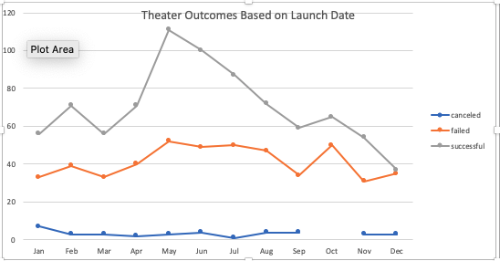
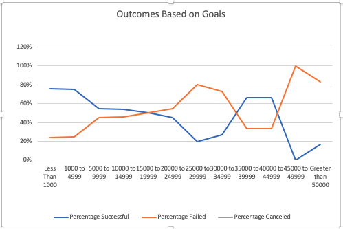

#An Analysis of Kickstarter Success Based on Launch Dates and Funding Goals

##The purpose of this analysis is to find the most effective time to launch a Kickstarter for a play and which range of funding goals are most likely to be successful

###Success Based on Launch Dates

Kickstarters launched in May and June have the highest success rates, while Kickstarters launched in November and December have the lowest success rates.

###Success Based on Funding Goals 

Kickstarters with funding goals in the range of $5,000 to $15,000 have over a 95% success rate. There is outlying data of campaigns with goals of $20,000 dollars or more which have a 100% success rate, but based on sample size the data supports strong evidence that a goal between $5,000 and $15,000 is likely to be successful.  

###Limitations of the Data Set

The data does not include a breakdown of urban versus rural areas in which Kickstarters were launched, therefore the data does not indicate success rates of cities launched in large cities compared to those launched in small towns. I would recommend an additional graph to display the success rate based on population size of where the Kickstarter was launched.

The data set also does not indicate which categories of plays were successful in their campaigns. For example, there is no indication as to whether comedies fare better than dramas. A graph to display the success rate of subcategories of plays would provide more detail. 

